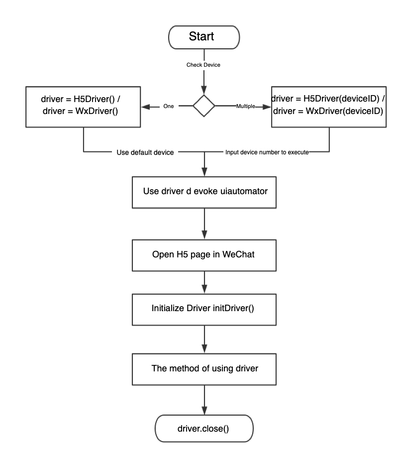

# FAutoTest

> An H5, small program automation test framework

## Introduction

As the product business form gradually extended from App to WeChat applet, WeChat public account and QQ public number, the previous automation construction was mainly based on Native App, and all manual testing could not meet the fast-growing business needs. In order to improve test efficiency and quality, the FAutoTest framework is dedicated to solving the automation problems of UI in QQ and WeChat (including H5 pages and applets in WeChat, H5 pages in QQ), improving the efficiency and stability of automated testing.

FAutoTest is a growing framework that draws on the excellent design concepts and ideas of some UI automation tools. If the framework has a shortcoming, or if you have better suggestions, please feel free to submit to Issues to contribute.

### Features

FAutoTest professionally serves UI automation testing of WeChat H5/small program to improve test efficiency and quality.

* Support WeChat H5 page, can identify common H5 controls, can get any content of the page (common such as text, pictures, links, etc.)
* Support control recognition, operation, page content acquisition, etc. in small programs
* Support Android Native page combination operation
* Simple API design, lower usage threshold
* Support basic performance test monitoring
* Strong function scalability and low expansion threshold

### Architecture 

1. The overall design is layered, and the API design method refers to WebDriver. 

2. The overall framework is a synchronous blocking model: the receive method is looped in a thread, waiting to receive the response, after the message is sent, blocking, only when the receive method gets the message, it will unblock and send the next message. Has a timeout exception handling mechanism

3. The Python version of UIAutomator is packaged in the framework for easy operation on the Android Native page.

  

   **User Interface: ** Provides all user interface APIs (H5 interface and applet interface). Users do not need to pay attention to the internal implementation of the framework. They only need to pay attention to their own business logic flow (manual use case flow conversion). Into an automated process)

   **PageOperator (operation resolution layer): ** mainly used to receive and parse user commands and pass to the lower engine layer

   **Engine (H5 & applet engine layer): ** Transfer user commands to the phone and return result information. Encapsulate WebSocket and single-threaded pool, establish a link with the browser kernel through the WebSocket Debug URL, and send the Json-formatted protocol to the mobile phone for user-specified operations.

### Business Process

* H5 page / applet UI automated execution process

  

* Automated script call process

  

## Dependent software environment

| Software | Software Requirements |
| ------------------ | ----------------------- |
| Python version | 2.7.x version |
| Java JDK version | Java language framework (minimum 1.7) |
| Android SDK version | 4.4 and above |
| adb version | latest version available |
| Python IDE development environment | such as PyCharm CE |

#### 1. Python version installation

Download & install [Python] (https://www.Python.org/downloads/), after installation, enter the commands `python -v` and `pip list` in the terminal, which can be executed, indicating that the Python environment configuration is successful.


#### 2. Java JDK version installation

Download & Install [Java JDK] (http://www.oracle.com/technetwork/java/javase/downloads/index.html) After installation, enter the command `java -version`, `java`, `javac` command in the terminal. If it can be executed, the Java environment is configured successfully.


#### 3. Android SDK version installation

Download & install [Android Studio] (https://developer.android.com/studio/) and install the `Android SDK" inside it.

#### 4. Configuring the adb environment

After installing Android Studio, configure the SDK environment (if the automatic installation is not successful, go to [Manual Download and Install] (http://developer.android.com/sdk/index.html), after installation, enter the command `adb version` in the terminal. If the result is executed, the configuration is successful.

#### 5. IDE installation

Download & Install [Pycharm CE] (https://www.jetbrains.com/pycharm/download/)

## FAutoTest Development Environment Installation 

| Library Name     | Version | Download Address                                  |
| ---------------- |  ------ | ------------------------- ----------------------- |
| uiautomator      |   0.3.2 | https://pypi.org/project/uiautomator/#files       |
| Lxml             |   4.2.3 | https://pypi.org/project/lxml/4.2.3/#files        |
| bidict           |  0.17.0 | https://pypi.org/project/bidict/#files            |
| Websocket-client |  0.44.0 | https://pypi.org/project/websocket-client/#files  |

* Use the `pip` installation framework for the third-party libraries `uiautomator`, `websocket-client`, `lxml`, `bidict`, such as `lxml`, `bidict`, `websocket-client`. `pip` Formal installation, such as installing `lxml`,

  ```
  Pip install lxml
  ```

* Install your own framework

  ```
  Pip install dist/fastAutoTest-xxx.whl (whl file please manually download in the dist directory)
  ```

* Open WeChat Debug mode, install TBS kernel
  * Open X5 debug address on WeChat: http://debugx5.qq.com
  * TBS kernel installation address: http://debugtbs.qq.com
  * For details, see: http://x5.tencent.com/tbs/guide/debug/faq.html

## How to use

How to write test cases, such as the WeChat H5 page, as follows:

```Python
# coding=utf-8
From fastAutoTest.core.h5.h5Engine import H5Driver

# http://h5.baike.qq.com/mobile/enter.html Enter this link from WeChat, execute the script after the first screen is loaded.
If __name__ == '__main__':
    h5Driver = H5Driver()
    h5Driver.initDriver()
    h5Driver.clickElementByXpath('/html/body/div[1]/div/div[3]/p')
    h5Driver.clickFirstElementByText('cataract')
    h5Driver.returnLastPage()
    h5Driver.returnLastPage()
    Print(h5Driver.getElementTextByXpath('/html/body/div[1]/div/div[3]/p'))
    h5Driver.close()

```

1. Initialize the H5 page from WeChat, such as [http://h5.baike.qq.com/mobile/enter.html] (http://h5.baike.qq.com/mobile/enter.html)
2. Go to the page and find the `xpath` of the control you want to manipulate. You can find the current page by `chrome:inspect` and find the `xpath` of the control.
3. Initialize the framework and make API calls, such as executing click controls, etc.
4. Close the framework and execute the use case

QQ's H5 page:

```Python
# coding=utf-8
From fastAutoTest.core.qq.qqEngine import QQDriver

#从动态-> Anime enters
If __name__ == '__main__':
    qqDriver = QQDriver()
    qqDriver.initDriver()
    qqDriver.clickFirstElementByText('Hero saves beauty, this is too romantic')
    qqDriver.returnLastPage()
    qqDriver.clickElementByXpath('//*[@id="app"]/div/ul/li[2]')
    qqDriver.returnLastPage()
    qqDriver.close()
```

1. From QQ Dynamics, enter the Anime H5 page
2. Find the `xpath` of the control you want to manipulate. Find the current page by `chrome:inspect` and find the `xpath` of the control.
3. Initialize the framework and make related API calls
4. Close the framework and execute the use case

WeChat applet:

```Python
# coding=utf-8
From fastAutoTest.core.wx.wxEngine import WxDriver
Import os

# Enter the penguin medical code applet
If __name__ == '__main__':
    wxDriver = WxDriver()
    wxDriver.initDriver()
    # click all diseases
    wxDriver.clickElementByXpath('/html/body/div[1]/div/div[3]/p')
    wxDriver.clickFirstElementByText('cataract')
    wxDriver.returnLastPage()
    wxDriver.returnLastPage()
    # Screenshot
    dirPath = os.path.split(os.path.realpath(__file__))[0]
    PIC_SRC = os.path.join(dirPath, 'pic.png')
    wxDriver.d.screenshot(PIC_SRC)
    wxDriver.close()
```

1. Search for small programs, such as the penguin medical program applet, into the applet page
2. Also look for the control's `xpath`, same as above
3. Initialize the framework and make related API calls
4. Close the framework and execute the use case

## Exchange group

For the exchange group, please scan the code to join the group below, and verify the response. FAutoTest refers to the introduction group.


## Related Links

[CONTRIBUTING](CONTRIBUTING.md)

[IFRAME](docs-english/IFRAME.md)

[NOTICES](docs-english/NOTICES.md)

[APPENDIX](docs-english/APPENDIX.md)

[APIs](docs-english/APIS.md)

[QA](docs-english/QA.md)

## contributing code

If you find bugs during use, please submit your feedback via Issues or Pull Requests, or join the exchange group to resolve.  
For the first time to contribute, please read: [CONTRIBUTING](CONTRIBUTING.md)

[Tencent Open Source Incentive Program] (https://opensource.tencent.com/contribution) Encourage developers to participate and contribute, and look forward to your joining.

## License

All code is open source using [BSD-3-Clause License] (LICENSE.txt)
