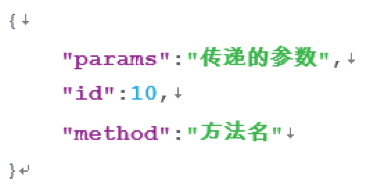
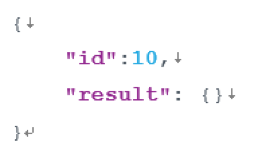
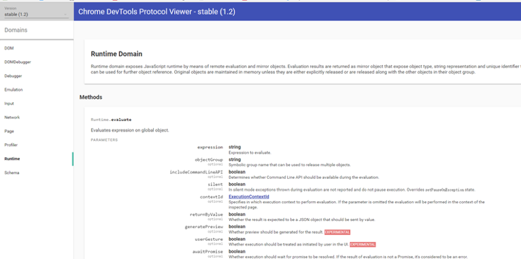
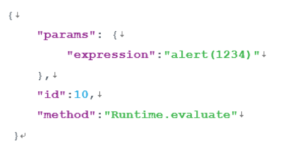
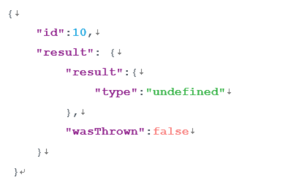

## Appendix

The Chrome Debugging Protocol [[*https://chromedevtools.github.io/devtools-protocol/) is the debugging protocol supported by the Blink kernel. The QQ and X5 browser kernels used by Chrome and WeChat are all based on Blink. Development, Chrome F12 and commonly used debugging tools are also based on the Chrome debugging protocol.

### Chrome Debug Protocol Format

* **Request**

  .

> 1. Id: not used, for one operation, request id = response id, id is only used to distinguish the response corresponding to the current request
> 2. Method: For the operation to be performed, see the module field below
> 3. Params: Perform the parameters passed by the operation, see the protocol document for details.

* **Response**

.

> 1. Id: same as the request id
> 2. Result: execution result

* **Module domain**

Google divides the operations to be performed according to different functional module domains ([domains](https://chromedevtools.github.io/debugger-protocol-viewer/1-2/)) to take a bullet box on the page as an example. :

Js popup operation corresponds to Runtime.evaluate method in Runtime domain

​       

Where ** send request** is:

.

**response:**

.
