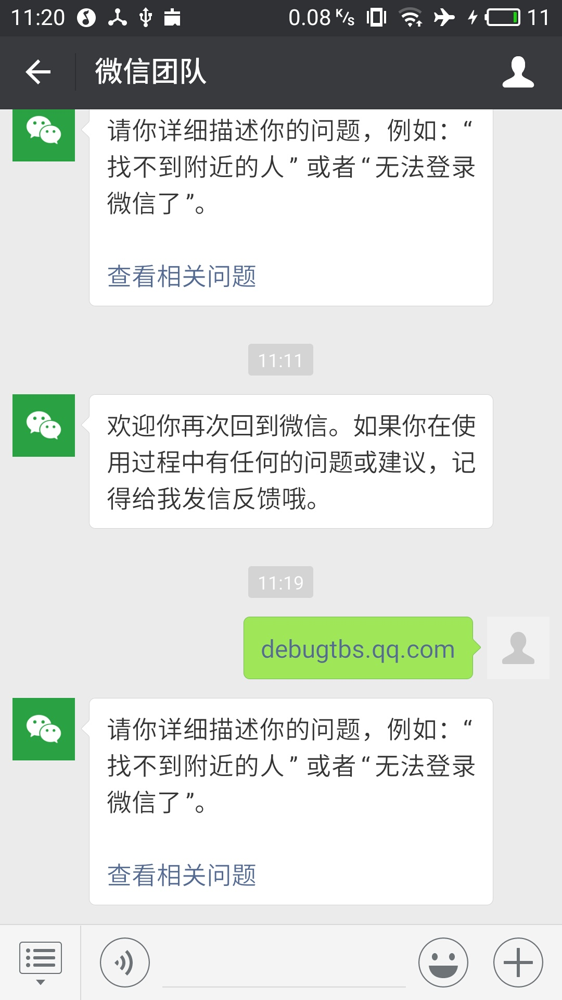
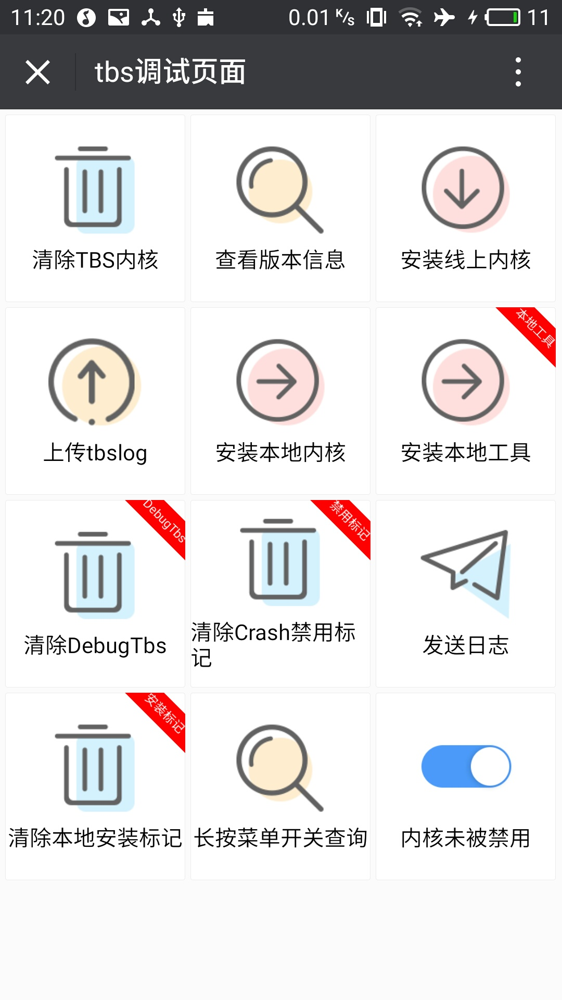
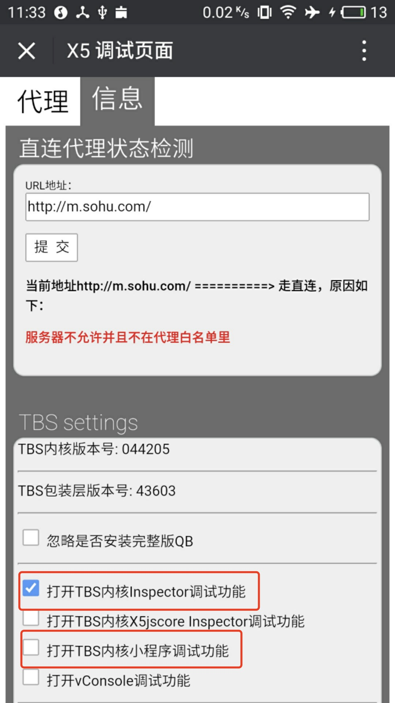
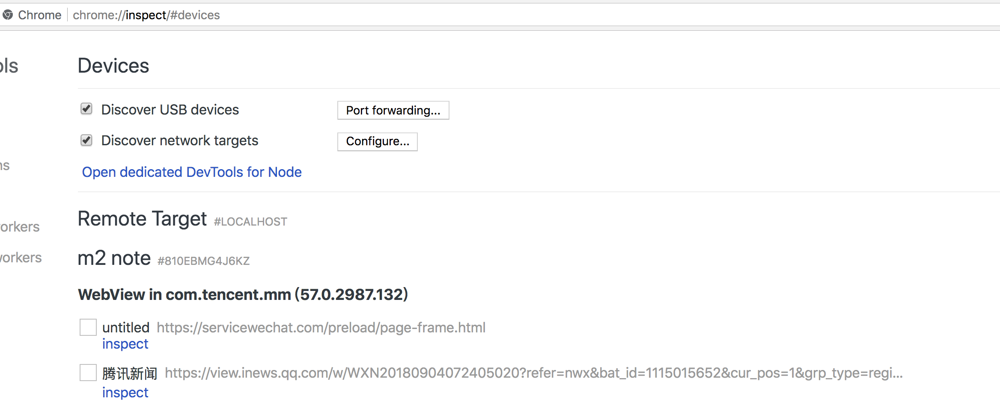

# Open WeChat Debug mode

1. Click on any of the chat windows

2. Send the message **debugtbs.qq.com** and click to enter

   

3. Enter the following interface, click to install the online kernel

   

4. After the installation is successful, continue to send the message **debugx5.qq.com** and click to enter

5. Go to the Information tab and check the two options as shown below.

   

6. After that, open any h5 page, and you can see the information on the page in **chrome:inspect**, indicating that the startup is successful.

   
