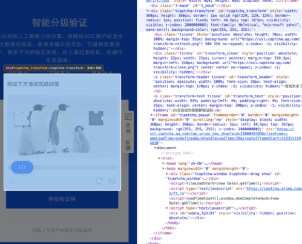
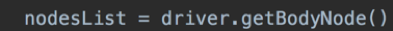
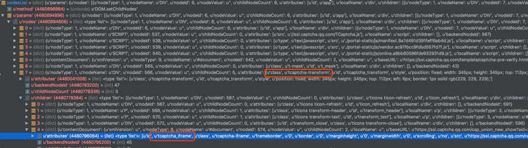
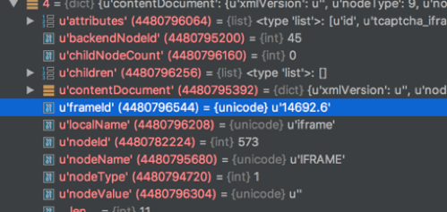
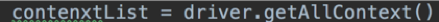
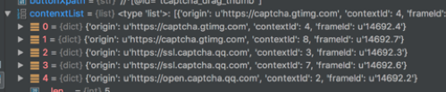
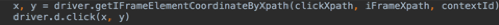
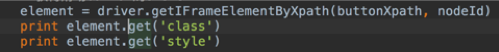

# How to operate a cross-domain IFrame page
- **https://open.captcha.qq.com/online.html Take this page as an example**

  1. When you click the Experience Verification Code button, as shown:
     * 

  2. The page to be operated is in a cross-domain IFrame. To manipulate the elements in this page, you must first get the **contextId** of the page.

     * First need to get the **frameId** of the IFrame.
     * Call the method to get the Node information of all elements. Figure:
       * 
     * nodeLIst results are as follows:
       * 
     * The **frameId** and **nodeId** of the IFrame page that needs to be manipulated are obtained through the tags in the HTML page:
       * 
     * Then call the following method:
       * 
     * Get **contextId** based on the previously found **frameId**
       * 
     * Compared to the above figure, **contenxtId** is 7.

  3. After getting the id, you can call the method to click, get the property, etc., according to the method, pass **nodeId** and **ContextId**

     * 
     * 
